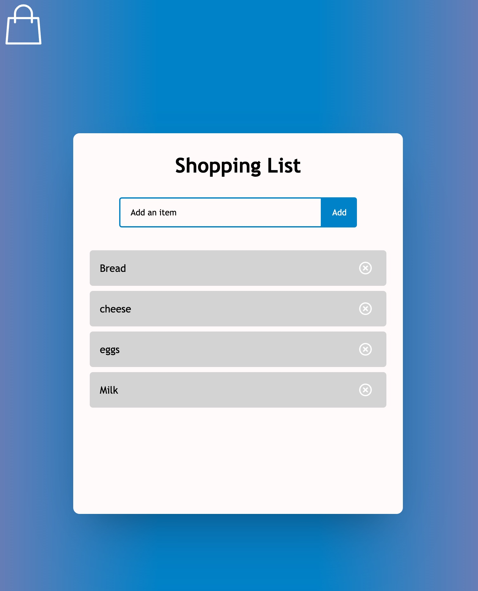
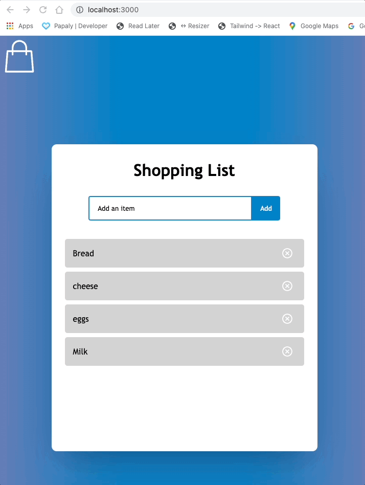
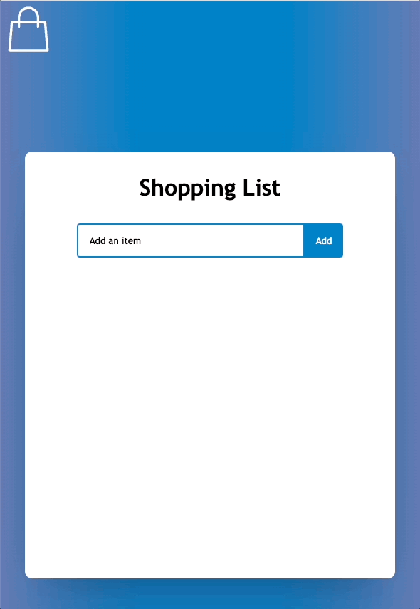
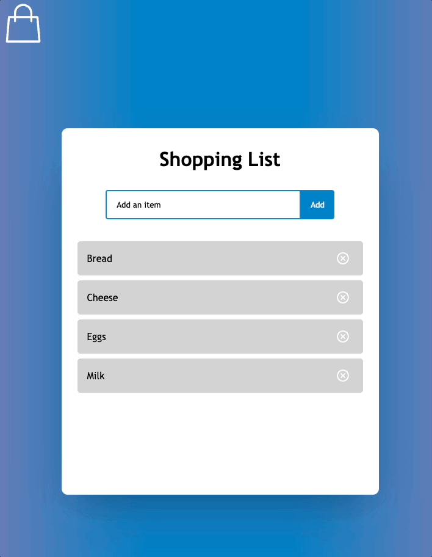
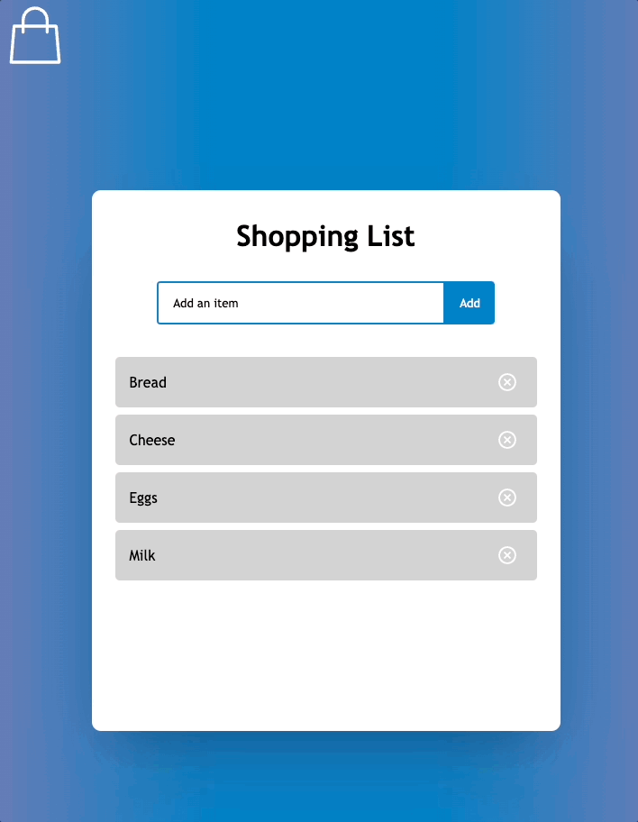

# React Shopping List



A simple SPA Shopping list app made using React TypeScript and Framer Motion

## Tech Stack

- Bootstrapped with [`create-react-app`](https://github.com/facebook/create-react-app)
- [Create React App Override](https://github.com/dilanx/craco) v6.5.4
- [React & React DOM](https://reactjs.org) v18
- [Framer Motion](https://www.framer.com/motion/) v7
- [React Icons](https://react-icons.github.io/react-icons/) v4.4
- Type Checker - [TypeScript](https://www.typescriptlang.org) v4.7.4
- Lint - [ESlint](https://eslint.org) v8 & [AirBnB](https://airbnb.io/javascript/)
- Format - [Prettier](https://prettier.io) v2.7.1

## Storage
For this app, list item are saved on the browser's local storage.

## Usage

Inside the project directory run using `npm` or `yarn`:
### Run

```bash
yarn start
# or
npm run start
```

Entry point `index.tsx`.

App will appear in the browser at http://localhost:3000

## Animations
A number of animations have been implemented in the app

### On page load
- Fade in of title and item input.
- Staggered fade in of existing list items.
- line draw in of bag svg icon.



## On adding a new item
- Fade in when added to list.
- Move down to make room for new item fading in.



## On removing an item
- Fade out on removal from list.
- Move up into space vacated by removed item.



### On click and drag
- List items reorder themselves accordingly.



## Create React App Override - [CRACO](https://github.com/dilanx/craco)
**C**reate **R**eact **A**pp **C**onfiguration **O**verride is a configuration layer for create-react-app.

It allows all the benefits of create-react-app **and** customization without using 'eject' by adding a single configuration (e.g. `craco.config.js`) file at the root of your application and, in this case, customization of the `.eslintrc` in order to enable the use of Import Path Aliasing.

### Current Configuration

### `craco.config.js`

```javascript
...
alias: {
      '@': path.resolve(__dirname, 'src'),
      '@components': path.resolve(__dirname, './src/components/'),
      '@pages': path.resolve(__dirname, './src/pages/'),
    }
...
```

### `tsconfig.paths.json`

```javascript
...
"paths": {
    "@/*": [
      "./src/*"
    ],
    "@components/*": [
      "./src/components/*"
    ],
    "@pages/*": [
      "./src/pages/*"
    ]
  },
...
```
## Available Scripts

In the project directory, you can run:

### `npm start` (from CRACO)

Runs the app in the development mode.\
Open [http://localhost:3000](http://localhost:3000) to view it in the browser.

The page will reload if you make edits.\
You will also see any lint errors in the console.

### `npm test` (from CRACO)

Launches the test runner in the interactive watch mode.\
See the section about [running tests](https://facebook.github.io/create-react-app/docs/running-tests) for more information.

### `npm run build` (from CRACO)

Builds the app for production to the `build` folder.\
It correctly bundles React in production mode and optimizes the build for the best performance.

The build is minified and the filenames include the hashes.\
Your app is ready to be deployed!

See the section about [deployment](https://facebook.github.io/create-react-app/docs/deployment) for more information.

### `npm run eject` (from CRACO)

**Note: this is a one-way operation. Once you `eject`, you can’t go back!**

If you aren’t satisfied with the build tool and configuration choices, you can `eject` at any time. This command will remove the single build dependency from your project.

Instead, it will copy all the configuration files and the transitive dependencies (webpack, Babel, ESLint, etc) right into your project so you have full control over them. All of the commands except `eject` will still work, but they will point to the copied scripts so you can tweak them. At this point you’re on your own.

You don’t have to ever use `eject`. The curated feature set is suitable for small and middle deployments, and you shouldn’t feel obligated to use this feature. However we understand that this tool wouldn’t be useful if you couldn’t customize it when you are ready for it.

## Learn More

You can learn more in the [Create React App documentation](https://facebook.github.io/create-react-app/docs/getting-started).

To learn React, check out the [React documentation](https://reactjs.org/).
